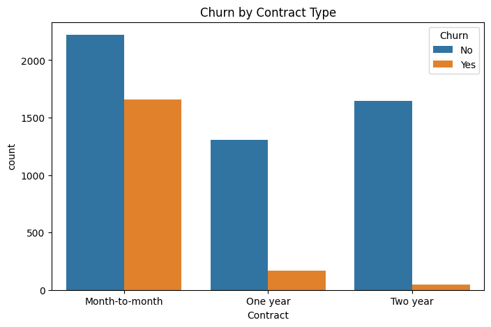
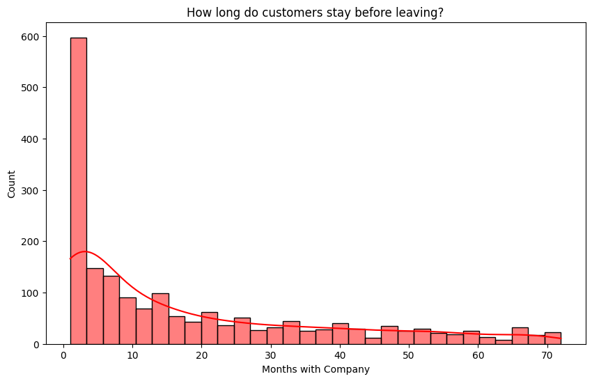
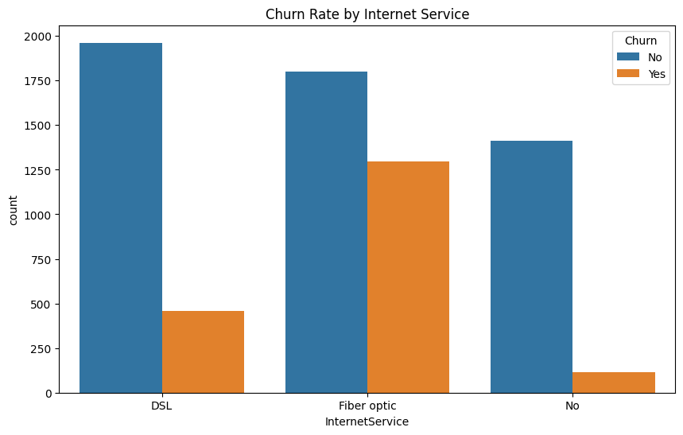
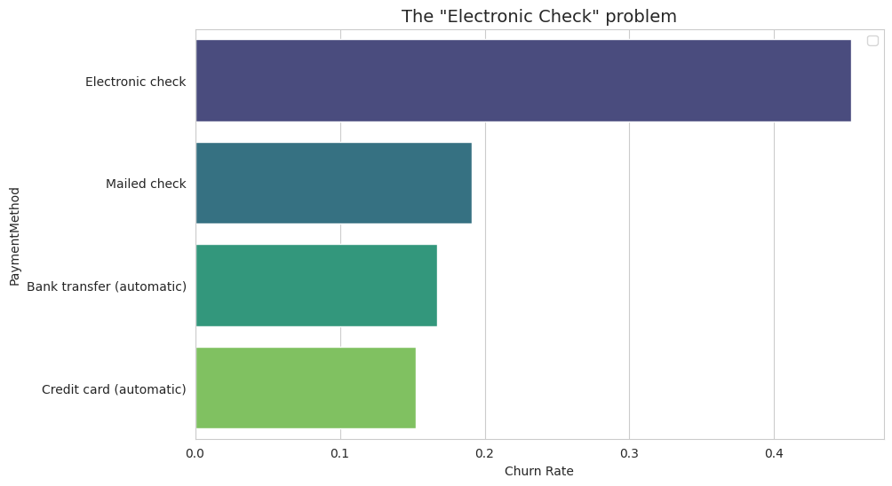
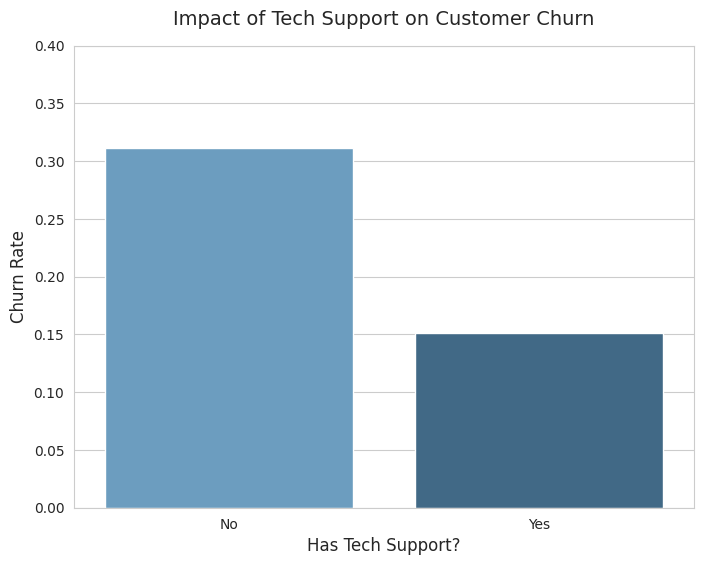

# 📉 Customer Retention & Churn Analysis

  

## 🔍 Business Scenario
A telecommunications company is facing a high rate of customer churn (26.5%). The business team needs to understand **why customers are leaving** and **which segments are most at risk**.

As a Data Analyst, I was tasked to:
1.  Analyze customer demographics, services, and billing patterns.
2.  Identify the root causes of churn.
3.  Provide actionable recommendations to improve retention.

---

## 📊 Key Insights & Visualizations

### 1. The "Month-to-Month" Trap
Customers on **Month-to-Month contracts** are the highest risk group. Those with 1-year or 2-year contracts almost never churn.

* *Insight: Lack of commitment leads to easy exit.*

### 2. The Critical "Onboarding" Period
Churn is highest in the first **0-6 months**. If a customer stays past 6 months, their loyalty increases significantly.

* *Insight: New users are not finding value quickly enough.*

### 3. The "Fiber Optic" Problem
Customers with **Fiber Optic** internet churn significantly more than those with DSL or No Internet.

* *Insight: High price or technical instability is driving away premium users.*

### 4. The "Electronic Check" Disaster
Customers paying via **Electronic Check** have a massive **45% churn rate**, compared to ~15% for Credit Card/Bank Transfer.

* *Insight: Manual payment friction causes users to re-evaluate their subscription every month.*

### 5. The Power of Tech Support (Sticky Features)
Customers who subscribe to **Tech Support** are nearly **50% less likely to churn** (15.2% vs 31.2%).

* *Insight: "Sticky" services like Tech Support and Online Security create ecosystem lock-in.*
---

## 💡 Strategic Recommendations
Based on the data, I recommend the following actions to the CEO/Product Team:

1.  **Incentivize Contracts:** Offer a **10% discount** to Month-to-Month users if they switch to a 1-Year Contract.
2.  **Fix the First 6 Months:** Launch a "New Customer Success" program (e.g., proactive check-in calls) for the first 90 days to prevent early churn.
3.  **Push Auto-Pay:** Create a campaign to migrate "Electronic Check" users to "Auto-Pay" by offering a one-time $5 bill credit.
4.  **Investigate Fiber Optic:** The Product Team must audit Fiber Optic service quality and pricing immediately, as it is losing high-value customers.
5.  **Tech Support Bundle:** Aggressively upsell **Tech Support** during signup. Consider giving "3 Months Free Tech Support" to new users to get them hooked, as this halves their churn risk.
---

## 🛠️ Tech Stack
* **Language:** Python
* **Libraries:** Pandas, NumPy, Matplotlib, Seaborn
* **Environment:** Jupyter Notebook / Google Colab

## 🛠️ Tools Used
* **Python:** Core language for analysis.
* **Pandas:** Data manipulation, cleaning, and aggregation.
* **Seaborn & Matplotlib:** Data visualization and dashboard creation.
* **Google Colab:** Development environment.

## 📂 Repository Structure
```text
├── pictures/                     # Stores the analysis images
│   ├── churn_contract.png
│   ├── churn_tenure.png
│   ├── churn_price.png
│   ├── churn_techsupport.png  
│   ├── churn_internet.png
│   └── churn_payment.png
├── DSTASK2.ipynb                 # Main Python analysis notebook
├── README.md                     # Project documentation
└── WA_Fn-UseC_-Telco-Customer-Churn.csv # Dataset used for analysis
